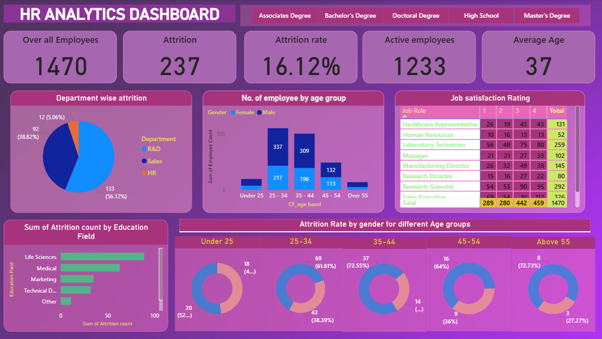

# HR Analytics Dashboard

## 📊 Overview
This project analyzes employee attrition using Power BI.

## 📌 Key Metrics
- Total Employees: 1470
- Attrition: 237
- Attrition Rate: 16.12%
- Average Age: 37

## 🔍 Insights
- Sales department has highest attrition
- Employees aged 25–34 leave more
- Life Sciences field has more attrition

## 🛠️ Tools Used
- Power BI

## 📷 Dashboard

